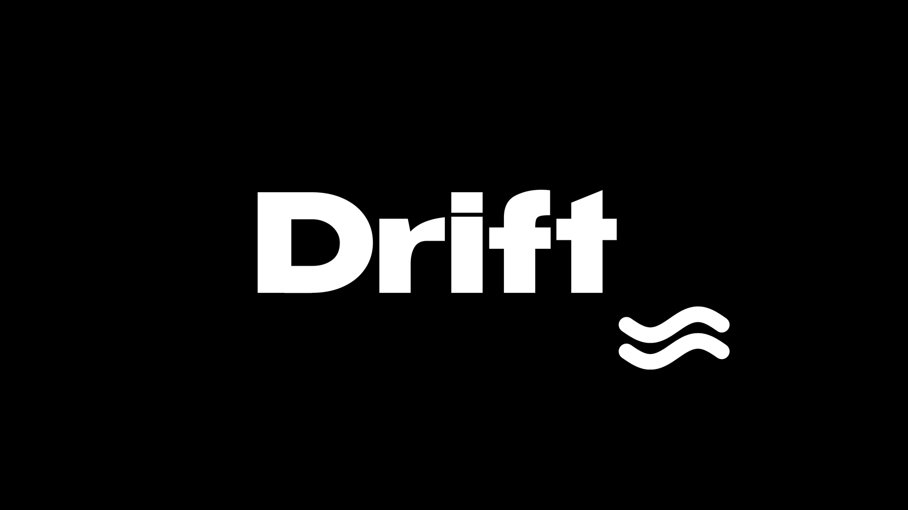

  

  <b>Живые видеообои для Windows — лёгкие, быстрые и красивые.</b> 
  Любое видео или GIF на рабочий стол. Работает на видеокарте и почти не трогает процессор.

  

  <a href="https://github.com/WhIteGh0s1/drift/releases">все версии</a> &nbsp;·&nbsp; <a href="#частые-вопросы">частые вопросы</a> &nbsp;·&nbsp; Windows 10 и 11 &nbsp;·&nbsp; меньше 1 МБ

 

## Как это работает

1. Ставишь Drift — установщик весит меньше мегабайта и не просит прав администратора.
2. Перетаскиваешь в окно Drift видео или GIF — или жмёшь «Добавить».
3. Видео уже на рабочем столе. Дальше Drift тихо живёт в трее и не мешает.

## Что умеет

### Обои

- **Любое видео или GIF** — mp4, mov, webm, mkv, wmv, avi, ts, gif. Только твои файлы, никаких каталогов и подписок.
- **Несколько мониторов** — на каждом свои обои или одни на все.
- **Плавная смена** — новые обои проявляются поверх старых, без чёрного кадра.
- **Автосмена** — обои меняются сами по таймеру, по порядку или вперемешку. Можно выбрать, какие видео в ней участвуют.
- **Своя скорость у каждого видео** — замедлить, чтобы было спокойнее, или ускорить.
- **Звук** — включается одной кнопкой, по умолчанию выключен.

### Быстрый и незаметный

- **Работает на видеокарте.** Около 0,5% процессора в 1080p.
- **0% нагрузки, когда стол не видно.** Окно на весь экран, игра, заблокированный компьютер — Drift ставит паузу сам. Может ставить паузу и от батареи.
- **Мгновенный старт.** Первый кадр становится обычными обоями Windows, поэтому после перезагрузки стол сразу выглядит правильно — ещё до запуска Drift.
- **Обновляется сам.** Новая версия скачивается в фоне и ставится в один клик.

### Если видео не играет

Windows открывает не всё: например, HEVC и AV1 без кодеков или GIF. Drift сам один раз перегоняет такое видео в подходящий формат — нужный для этого конвертер он тоже скачает сам. А кнопка «оптимизировать» ужимает тяжёлое видео под размер экрана, чтобы оно шло ещё легче.

### Вместе с Relin

В [Relin](https://github.com/WhIteGh0s1/relin) у любого скачанного или обработанного видео есть кнопка «в Drift» — и оно сразу становится обоями. Скачал клип с YouTube — через секунду он на рабочем столе.

## Установка

1. [Скачай установщик](https://github.com/WhIteGh0s1/drift/releases/latest/download/Drift-setup.exe) и запусти.
2. Нажми «Установить». Можно сразу включить ярлык на рабочем столе и запуск вместе с Windows.

Нужна Windows 10 или 11 (64-бит) — всё остальное в ней уже есть.

Удалить — как любую программу: «Параметры → Приложения → Drift». Drift вернёт твои обычные обои, а твои видео останутся на месте.

## Частые вопросы

<b>Сколько Drift ест ресурсов?</b>

Видео декодирует видеокарта, поэтому процессор почти не занят — около 0,5% в 1080p. Памяти — примерно 160–240 МБ. Когда рабочий стол закрыт окнами или игрой, Drift на паузе и не тратит ничего.

<b>Видео не воспроизводится</b>

Значит, Windows не умеет этот формат. Drift сам предложит подготовить видео: перегонит его один раз и дальше будет играть уже готовую копию. Первый раз он скачает для этого конвертер — подожди минуту.

<b>Как вернуть обычные обои?</b>

Правой кнопкой по значку Drift в трее → «Убрать живые обои». Или просто удали Drift — он вернёт то, что стояло до него.

<b>Будет ли тормозить в играх?</b>

Нет. Когда игра или любое окно закрывает рабочий стол целиком, Drift останавливает видео и не нагружает ни процессор, ни видеокарту.

<b>Где взять видео для обоев?</b>

Любое своё видео или GIF. Удобно качать через [Relin](https://github.com/WhIteGh0s1/relin): кнопка «в Drift» сразу ставит скачанное на рабочий стол.

 

Little White Ghost

